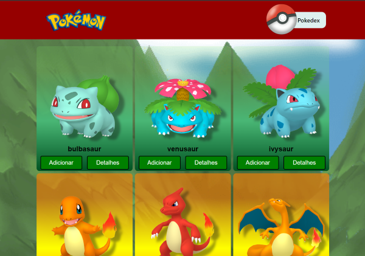
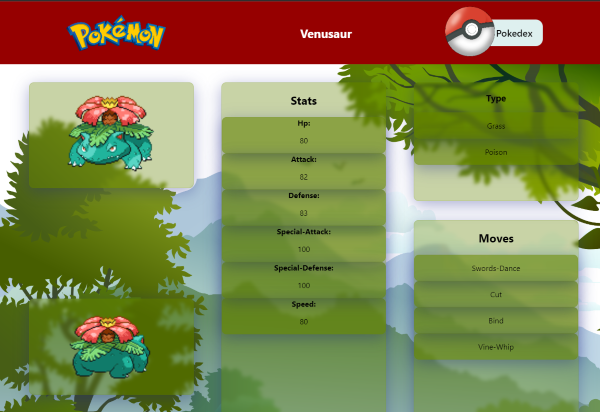
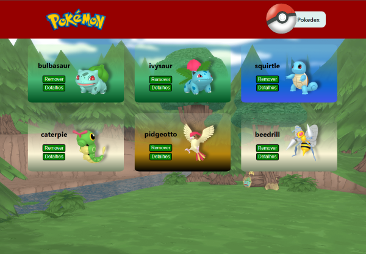
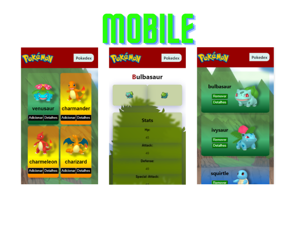

# Projeto Pokedex

Plataforma Web para listagem e visualização de Pokémons.
Para o desenvolvimento desse projeto foi utilizado ReactJS.
Dados dos Pokémons foi utilizado a API do [PokéApi](https://pokeapi.co/).

# Link Surge

[---Clique.Aqui---](http://glistening-train.surge.sh/)

# Tecnologias

[x]React
[x]Styled-components
[x]Axios
[x]React Router

# Funcionalidades

* Listagem de Pokémons: Listar os Pokémons com o uso da API.
* Selecionar Pokémons: Ao selecionar o Pokémon ele vai para a listagem da Pokedex onde será possivel remover se assim preferir.
* Página Detalhes: Onde será possivel visualizar as informações como: nome, type, moves, stats e photos.

# Observações gerais

* Listagem de Pokemons foi limitada a 20.

# Responsividade

* Desktop
* Mobile

# Página Home:

# Página Detalhes

# Página Pokedex

# Página Pokedex Vazia

# Versão Mobile

